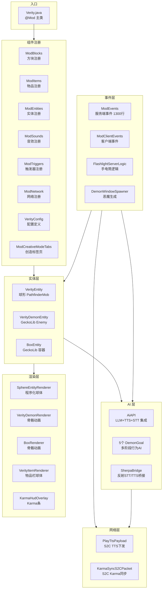
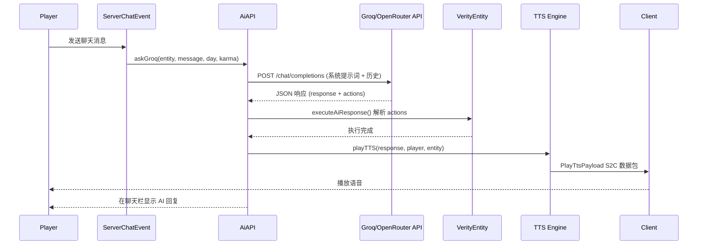
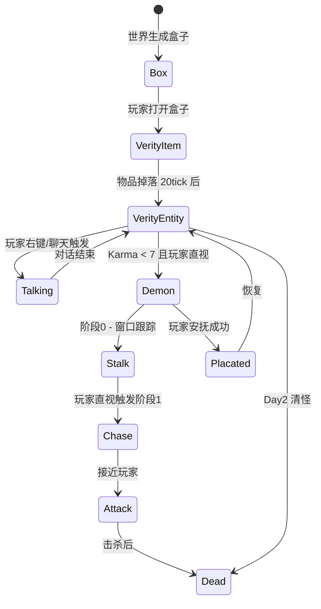

# 系统架构

## 概述

Verity JE 是一个 Minecraft NeoForge 1.21.1 恐怖生存模组。它引入了一个具备 AI 对话能力的球形生物 "Verity"——它能根据玩家的行为发展 Karma 值，并在 Karma 过低时转化为恶魔形态追猎玩家。模组包含多阶段 AI 行为、实时语音对话（通过 Groq/OpenRouter/Ollama 集成的 LLM + TTS/STT）、动态光照手电筒系统、极限黑暗环境，以及 GeckoLib 驱动的 3D 动画渲染。

**核心能力**：
- AI 驱动的生物对话：玩家通过文字或语音与 Verity 互动，AI 根据游戏上下文（天数、Karma、NBT 数据）动态回复
- 多阶段恐怖追逐：恶魔有窗口跟踪、凝视转化、破门、碎玻璃跳跃、近战攻击等 5+ 阶段行为
- 全亮无着色物品渲染：Verity 物品在背包中恒亮，不受环境光影响
- 实时语音输入：按 V 键录音，经本地 Sherpa STT 转写后发送到聊天触发 AI 对话

## 技术栈

**语言与运行时**
- Java 21
- Gradle 8.x (NeoForge ModDevGradle 2.0.142)

**框架**
- NeoForge 21.1.234 (Minecraft 1.21.1)
- GeckoLib 4.8.3 (实体动画与模型)
- YACL 3.7.0 (图形化配置界面)
- Parchment 2024.11.10 (Mojang 反混淆映射)

**外部服务**
- Groq API (LLM 对话 + 云端 TTS)
- OpenRouter API (LLM 对话备选)
- Ollama (本地 LLM 备选)
- Sherpa-ONNX (本地 STT 语音识别 + 本地 TTS 语音合成，可选依赖)

**渲染**
- OpenGL 程序化球体网格生成 (SphereMesh)
- Billboard 朝向渲染 (SphereRenderHelper)
- HSB 色相旋转纹理着色
- Mixin 注入动态光照 (手电筒)

## 项目结构

```
verity-JE/
├── build.gradle                    # NeoForge ModDevGradle 构建配置
├── gradle.properties               # JVM 参数、并行构建
├── settings.gradle                 # 仓库与工具链配置
├── src/main/
│   ├── java/varmite/verity/
│   │   ├── Verity.java             # @Mod 主入口，注册所有组件
│   │   ├── VerityClient.java       # YACL 配置界面工厂
│   │   ├── VerityConfig.java       # ModConfigSpec 配置项定义
│   │   ├── AiProvider.java         # AI 提供商枚举
│   │   ├── AiModel.java            # AI 智能级别枚举
│   │   ├── VerityVoice.java        # 云端 TTS 语音枚举
│   │   ├── KokoroVoice.java        # Kokoro 本地 TTS 语音枚举
│   │   ├── SetEntityTalkingPacket.java  # 实体说话状态数据包
│   │   ├── block/                  # 方块注册 + 手电筒光照方块
│   │   ├── item/                   # 物品注册 + 变体纹理 + 无着色模型
│   │   ├── entity/                 # 实体注册 + 自定义实体 + AI 行为
│   │   ├── event/                  # 事件处理器（服务端 + 客户端）
│   │   ├── gui/                    # Karma HUD + PlayerKarma 能力
│   │   ├── client/                 # 客户端渲染 + 音效 + 音频输入
│   │   ├── command/                # /changekarma + /recoververity
│   │   ├── network/                # S2C 数据包 (TTS + Karma)
│   │   ├── sounds/                 # 音效事件注册
│   │   ├── triggers/               # 8 种自定义进度触发器
│   │   ├── mixin/                  # Mixin 注入 (光照 + 标题界面)
│   │   └── util/                   # Sherpa 模型解压器
│   └── resources/
│       ├── pack.mcmeta
│       ├── mixins.verity.json
│       ├── data/verity/jukebox_song/  # 唱片定义
│       └── assets/verity/
│           ├── sounds.json
│           ├── models/item/          # 物品模型 JSON
│           ├── animations/entity/    # GeckoLib 动画 JSON
│           ├── sounds/               # 15 个 .ogg 音效文件
│           └── textures/intro/       # 532 帧 PNG 开场动画
```

**入口点**
- `Verity.java` 构造函数 — 模组初始化入口
- `ModBusClientSetup.java` — 客户端渲染注册入口

## 子系统

### 实体系统 (entity/)

**目的**: 管理 3 种自定义生物实体的注册与行为。

**位置**: `src/main/java/varmite/verity/entity/`

**关键文件**: `ModEntities.java`, `custom/VerityEntity.java`, `custom/VerityDemonEntity.java`, `custom/BoxEntity.java`

**依赖**: GeckoLib 动画系统, NeoForge 能力系统 (WorldSpawnData)

**被依赖**: 事件处理器, AI 系统, 渲染系统, 网络同步

**描述**:
- **VerityEntity**: 核心球形生物，可滚动、弹跳、说话，根据 Karma 值变换纹理变体，低 Karma 时转化为恶魔
- **VerityDemonEntity**: 恶魔形态，GeckoLib 骨骼动画，5+ 阶段 AI 行为，可爬墙、破门、碎玻璃跳跃
- **BoxEntity**: 初始容器实体，播放循环语音引导玩家打开，触发 Verity 生成

### 渲染系统 (entity/client/, client/)

**目的**: 处理所有自定义渲染，包括球体程序化网格、GeckoLib 骨骼动画、色相纹理生成、物品栏渲染。

**位置**: `entity/client/`, `client/`

**关键文件**: `SphereEntityRenderer.java`, `SphereMesh.java`, `SphereRenderHelper.java`, `VerityDemonRenderer.java`, `BoxRenderer.java`, `VerityEntityTexture.java`, `IntroVideoScreen.java`

**依赖**: OpenGL, GeckoLib, Minecraft 光照系统

**被依赖**: 注册在 ModBusClientSetup 中

**描述**:
- 球体通过经纬线细分程序化生成 UV 网格
- Billboard 朝向使球体始终面朝玩家
- HSB 色相旋转实现纹理动态变色
- Verity 物品在背包中以无着色模型渲染（全亮 fullbright）
- 532 帧 24fps 开场动画

### AI 集成系统 (entity/AI/)

**目的**: 连接玩家与 LLM 服务的桥梁，处理对话请求、语音合成、语音识别。

**位置**: `entity/AI/`

**关键文件**: `AiAPI.java` (634行), `SherpaBridge.java`, `VerityLocalTTS.java`

**依赖**: Groq/OpenRouter/Ollama API, Sherpa-ONNX (可选), Piper TTS

**被依赖**: VerityEntity, 事件处理器

**描述**:
- 多路 LLM 后端：Groq (默认) / OpenRouter / Ollama
- 多路 TTS：Groq 云端 / Piper 本地 / Kokoro 本地 / 系统原生
- 多路 STT：Sherpa 本地 / Whisper 本地 / Groq 云端
- 动态系统提示词：根据天数、Karma、NBT 数据构建上下文
- 3D 空间音效：TTS 输出根据实体位置调整音量

### 事件与游戏机制 (event/)

**目的**: 处理所有服务端和客户端游戏事件，包括玩家交互、AI 对话触发、恶魔生成、手电筒逻辑、Karma 更新。

**位置**: `event/`

**关键文件**: `ModEvents.java` (1300行), `ModClientEvents.java`, `DemonWindowSpawner.java`, `FlashlightServerLogic.java`

**依赖**: 实体系统, AI 系统, 网络同步, 持久化

**被依赖**: 在 Verity.java 中通过 MOD/GAME 总线注册

**描述**:
- ModEvents 是最大类，处理聊天事件解析 AI 请求、方块交互、生物死亡 Karma 扣减等 30+ 事件
- 恶魔生成调度：箱子关闭后延迟生成，窗口后追踪生成
- 手电筒动态光照：射线检测放置不可见光源方块
- 玩家安抚逻辑：在恶魔附近发送特定消息可使其平静

### 配置系统

**目的**: 提供约 25 个可配置项，通过 YACL 实现图形化界面。

**位置**: `VerityConfig.java`, `VerityClient.java`

**关键文件**: `VerityConfig.java` (静态初始化块定义配置项), `VerityClient.java` (YACL 界面构建)

**依赖**: YACL 3.7.0, NeoForge ModConfigSpec

**被依赖**: 全局引用

**描述**:
- 三大分类：General / AI & Voice / Customization
- 支持实时重载，配置变更时触发全面渲染刷新
- 色相配置项配有实时预览纹理

## 架构图





## 关键流程

### Verity 生命周期



### 恶魔 AI 行为阶段

| 阶段 | 名称 | 行为 | 触发条件 |
|------|------|------|---------|
| 0 | 跟踪 | 在远处凝视、窗口出现、碎玻璃现身 | 默认初始阶段 |
| 1 | 追逐 | 路径导航追玩家、可穿透玻璃 | 玩家直视 0.5 秒 |
| 2 | 接近 | 加速靠近、准备攻击 | 距离玩家 10 格内 |
| 3 | 攻击 | 50%抓取 / 50%普通攻击 | 距离玩家 2 格内 |
| 4 | 破门 | 破坏木门追击 | 路径上有门 |

## 设计决策

1. **球体渲染不走 GeckoLib**：VerityEntity 使用程序化球体网格 + Billboard，而非 GeckoLib 骨骼模型，因为球体不需要骨骼变形，程序化生成更高效且支持动态色相着色。

2. **Sherpa-ONNX 反射加载**：STT/TTS 库不声明为编译依赖，通过 `SherpaBridge` 反射调用。若 JAR 中无 sherpa-onnx，功能静默降级而不报错。

3. **手电筒用不可见方块实现**：而非自定义光照管线，这保证与原版光照系统完全兼容，通过 Mixin 注入提供动态光照效果。

4. **物品全亮渲染使用 BakedModelWrapper**：`UnshadedBakedModel` 覆盖每个 quad 的颜色为白色、光照为全亮(0xF000F0)，使物品在背包中恒亮不受环境光影响。

5. **双 Karma 同步机制**：`PlayerKarma` (Attachment, 每玩家) + `WorldSpawnData` (SavedData, 全局)。前者用于 HUD 显示，后者用于跨维度持久化。
