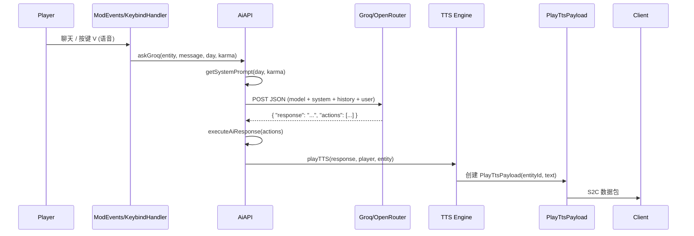

# AI 对话系统

AiAPI 是 Verity 模组的 AI 集成心脏，负责连接 Minecraft 游戏世界与外部 LLM 服务，实现实时对话、语音合成和语音识别。

## 什么是 AI 对话系统？

AiAPI 处理从"玩家输入"到"Verity 语音回复"的完整管线：构建包含游戏上下文的系统提示词 -> 发送 HTTP 请求到 LLM -> 解析 JSON 响应 -> 执行 actions -> 播放 TTS 语音。

**关键特征**:
- 多路 LLM 后端：Groq (默认) / OpenRouter / Ollama (本地)
- 多路 TTS 引擎：Groq 云端 / Piper 本地 / Kokoro 本地 / 系统原生
- 多路 STT 引擎：Sherpa 本地 / Whisper 本地 / Groq 云端
- 动态系统提示词：根据游戏天数、Karma、手持物品、NBT 数据构建
- 3D 空间音效：TTS 输出根据实体与玩家相对位置计算音量/声道
- 10 条聊天历史缓存于 WorldSpawnData

## 代码位置

| 方面 | 位置 |
|------|------|
| 核心 API | `entity/AI/AiAPI.java` (634 行) |
| Sherpa 桥接 | `entity/AI/SherpaBridge.java` |
| Piper 本地 TTS | `entity/AI/VerityLocalTTS.java` |
| STT 模型解压 | `util/ModelExtractor.java` |
| TTS 数据包 | `network/PlayTtsPayload.java` |
| 客户端 TTS 处理 | `network/PlayTtsClientHandler.java` |
| 录音器 | `client/audio/MicrophoneRecorder.java` |
| 麦克风管理 | `client/audio/MicrophoneManager.java` |

## 对话流程

## 系统提示词结构

`getSystemPrompt(long day, float karma)` 构建的提示词包含：

- **角色定义**: "You are Verity, a sentient spherical creature in Minecraft..."
- **当前状态**: 游戏天数、Karma 值、与玩家的关系阶段
- **上下文**: 玩家手持物品、位置、维度
- **响应格式**: 要求返回 `{"response": "...", "actions": [...]}` JSON
- **Actions 语法**: 支持的 actions 列表及参数格式

### 支持的 Actions

| Action | 参数 | 说明 |
|--------|------|------|
| `get_coords` | - | 获取玩家坐标 |
| `get_inventory` | - | 获取玩家背包内容 |
| `play_sound` | `sound: String` | 播放指定音效 |
| `drop_item` | `item: String, count: int` | 掉落物品 |
| `transform_following_day` | - | 次日转化 |
| `forgive` | - | 原谅玩家 (+Karma) |
| `get_nearest_village` | - | 获取最近村庄坐标 |

## TTS 引擎选择优先级

`playTTS()` 按以下顺序选择引擎：

1. 若 `USE_SYSTEM_TTS` 启用 -> 系统原生 TTS (javax.sound.sampled)
2. 若 `LOCAL_TTS` 启用 -> Piper TTS (通过 SherpaBridge)
3. 若 `KOKORO_VOICE` 设置 -> Kokoro TTS (通过 SherpaBridge)
4. 回退 -> Groq 云端 TTS API

每种引擎输出的音频格式不同（采样率、位深、声道），`apply3DEffect()` 统一转换为 3D 空间音效。

## STT 引擎选择优先级

`transcribeAudio()` 按以下顺序选择引擎：

1. 若 `LOCAL_STT` 启用 -> Sherpa-ONNX 本地识别
2. 若 `WHISPER_CPP` 启用 -> Whisper.cpp 本地识别
3. 回退 -> Groq 云端 Whisper API

## 不变量

1. **API Key 隔离**: API Key 存储在 VerityConfig 中，不硬编码在 AiAPI 内。
2. **Sherpa 可选**: SherpaBridge 通过反射加载，若 JAR 中无 sherpa-onnx，所有本地 TTS/STT 功能静默降级。
3. **聊天历史容量**: WorldSpawnData 中最多缓存 10 条 (5 轮对话)。
4. **3D 音效绑定**: `apply3DEffect()` 的 SourceDataLine 在实体死亡或新 TTS 开始时关闭。
