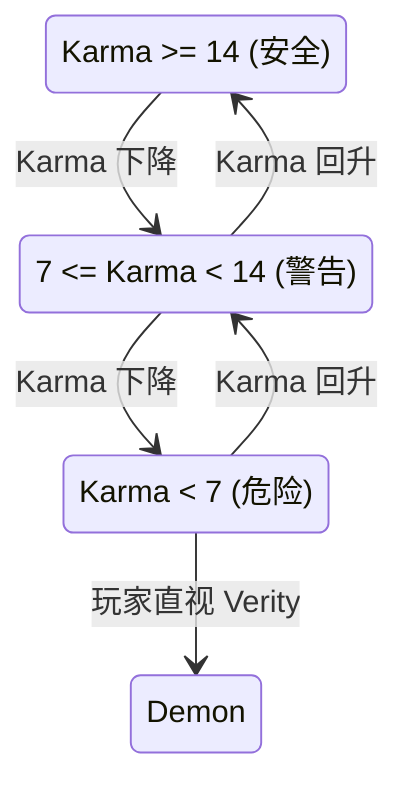

# Karma 系统

Karma 是 Verity 模组的核心机制，一个 0-20 的整数值代表 Verity 对玩家的"好感度"。高 Karma 使 Verity 保持友好，低 Karma 触发恶魔转化和敌对行为。

## 什么是 Karma？

Karma 代表玩家与 Verity 之间的关系健康度。20 为完美状态，0 为最差。当 Karma 低于 7 时，Verity 可能转化为恶魔。

**关键特征**:
- 取值范围 0-20，初始值为 14
- 存储两份：`PlayerKarma` (每玩家 Attachment) 和 `WorldSpawnData` (全局 SavedData)
- 通过 `KarmaSyncS2CPacket` S2C 同步到客户端
- 在 HUD 右侧以垂直条形式显示

## 代码位置

| 方面 | 位置 |
|------|------|
| 数据模型 | `gui/PlayerKarma.java` |
| Attachment 注册 | `gui/PlayerKarmaProvider.java` |
| HUD 渲染 | `gui/KarmaHudOverlay.java` |
| 客户端缓存 | `network/ClientKarmaData.java` |
| 网络同步 | `network/KarmaSyncS2CPacket.java` |
| 服务端逻辑 | `event/ModEvents.java` (updateAndSyncKarma, setAndSyncKarma) |

## Karma 变化规则

### 增加 Karma 的行为
- 与 Verity 进行友好对话（AI 判定为正面）
- 完成 Verity 的任务或请求
- 使用 `/changekarma` 命令手动增加

### 减少 Karma 的行为
- 杀死生物（任何类型）
- 与 Verity 进行敌对对话
- 触发恶魔转化后持续降低
- 使用 `/changekarma` 命令手动减少

## Karma 与恶魔转化

**转化条件**: Karma < 7 且玩家直视 Verity 实体至少 0.5 秒时触发 `transformIntoDemon()`。

## 不变量

1. **Karma 边界**: Karma 值始终在 [0, 20] 区间内，`addKarma` 和 `subKarma` 方法保证不越界。
2. **同步一致性**: 客户端 `ClientKarmaData` 仅缓存最新同步值，以服务端 `PlayerKarma` 为准。
3. **死亡保留**: Karma 在玩家死亡时通过 `canCopyOnDeath = true` 保留。
4. **全局持久化**: `WorldSpawnData` 中的 Karma 用作跨维度/重连的最后一个已知值。

## HUD 显示

KarmaHudOverlay 在屏幕右侧渲染垂直 Karma 条：

- 表情图标 (16x16) 位于顶部：
  - Karma 0-6: 愤怒脸 (`angry.png`)
  - Karma 7-13: 中性脸 (`neutral.png`)
  - Karma 14-20: 开心脸 (`happy.png`)
- Karma 条 (182x5) 位于表情下方：
  - 背景: `empty.png` (灰色底)
  - 填充: `full.png` (颜色渐变，宽度按 Karma/20 比例)
- 沉浸模式下隐藏
