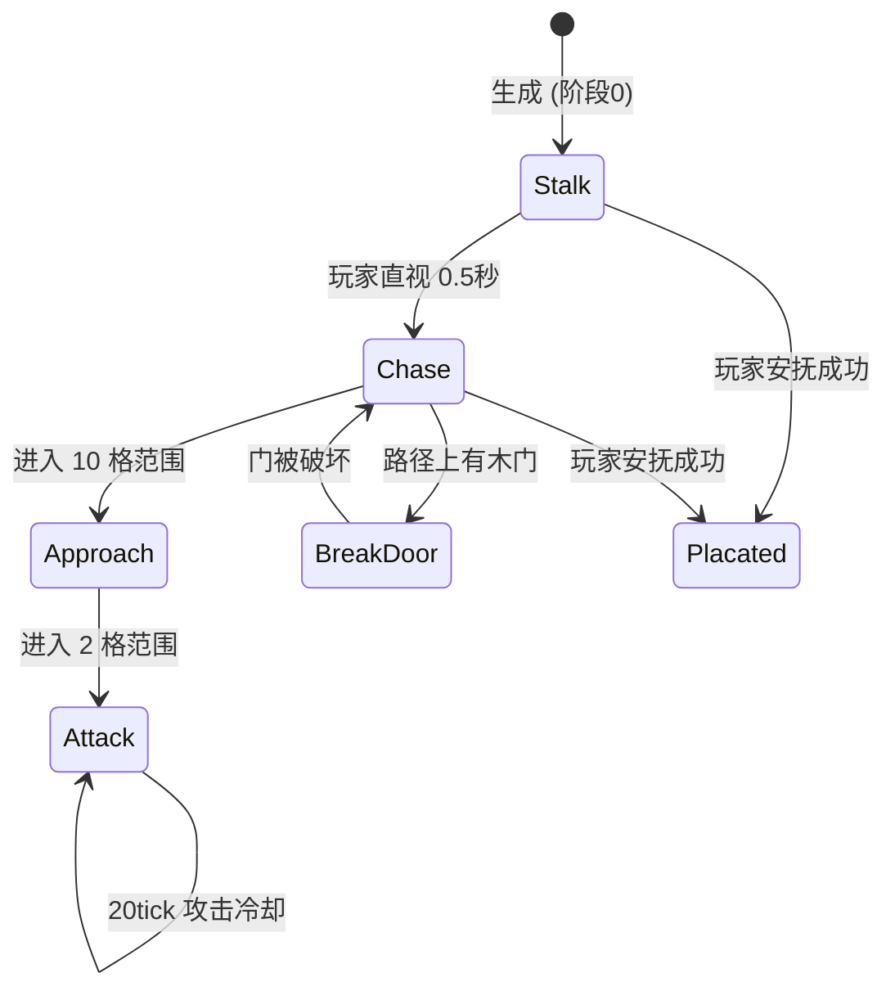

# 恶魔实体

VerityDemonEntity 是 Verity 的低 Karma 恶魔形态，继承 `PathfinderMob` 并实现 `GeoEntity` 和 `Enemy` 接口，由 GeckoLib 驱动骨骼动画。

## 什么是恶魔实体？

当 Karma 低于 7 且玩家直视 Verity 时，Verity 会转化为恶魔。恶魔是一个 1.2x3.0 方块的人形生物，具备多阶段 AI 行为，从窗口跟踪到破门追猎。玩家可以通过发送特定安抚消息使其恢复。

**关键特征**:
- GeckoLib 驱动的完整骨骼动画（行走、爬行、攻击、破门）
- 5 阶段 AI 行为：跟踪 -> 追逐 -> 接近 -> 攻击 -> 破门
- 特殊能力：爬墙、透过玻璃看到玩家、碎玻璃跳跃、使用/破坏门
- 自定义路径导航：可穿过玻璃、窗格和树叶方块
- 声音系统：追击循环音效 (DemonChaseSoundInstance)

## 代码位置

| 方面 | 位置 |
|------|------|
| 实体类 | `entity/custom/VerityDemonEntity.java` |
| 模型 | `entity/client/VerityDemonModel.java` |
| 渲染器 | `entity/client/VerityDemonRenderer.java` |
| 攻击 AI | `entity/AI/DemonAttackGoal.java` |
| 破门 AI | `entity/AI/DemonBreakDoorGoal.java` |
| 碎玻璃跳跃 AI | `entity/AI/DemonGlassBreakAndLeapGoal.java` |
| 凝视转化 AI | `entity/AI/DemonStareAndBreakGoal.java` |
| 窗口跟踪 AI | `entity/AI/DemonWindowStalkGoal.java` |
| 路径导航 | `entity/AI/pathfinding/DemonPathNavigation.java` |
| 路径评估器 | `entity/AI/pathfinding/DemonNodeEvaluator.java` |
| 生成逻辑 | `event/DemonWindowSpawner.java` |
| 安抚逻辑 | `event/VerityPleadingHandler.java` |
| 追击音效 | `client/sound/DemonChaseSoundInstance.java` |

## 关键字段

| 字段 | 类型 | 描述 |
|------|------|------|
| `demonState` | `int` | AI 阶段 (0-4) |
| `huntPhase` | `String` | 狩猎子阶段 |
| `climbing` | `boolean` | 是否在攀爬 |
| `crawling` | `boolean` | 是否在爬行 |
| `attackCooldown` | `int` | 攻击冷却 tick |
| `grabTarget` | `LivingEntity` | 当前抓取目标 |

## AI 行为阶段

| 阶段 | 数值 | AI Goal | 行为 |
|------|------|---------|------|
| 跟踪 | 0 | `DemonWindowStalkGoal` + `DemonStareAndBreakGoal` | 在远处凝视玩家、窗口后出现、瞬移换位 |
| 追逐 | 1 | 路径导航 + `DemonBreakDoorGoal` | 追向玩家、破坏木门、播放追击音效 |
| 接近 | 2 | 加速导航 | 10 格内快速接近 |
| 攻击 | 3 | `DemonAttackGoal` | 2 格内近战：50% 抓取、50% 普通攻击 |
| 跳跃 | - | `DemonGlassBreakAndLeapGoal` | 打碎路径玻璃方块后跳向玩家，播放 jumpscare 音效 |

## 不变量

1. **状态单调递增**: `demonState` 一旦增加不会减少（只能从 0->1->2->3->4 或安抚后重置）。
2. **爬行和攀爬互斥**: `isClimbing()` 和 `isCrawling()` 不能同时为 true。
3. **动画与状态一致**: GeckoLib 动画控制器根据 `demonState`、`isClimbing`、`isCrawling` 自动切换动画。
4. **玻璃透视**: `hasLineOfSightThroughGlass()` 专门处理玻璃方块的视线判定。
