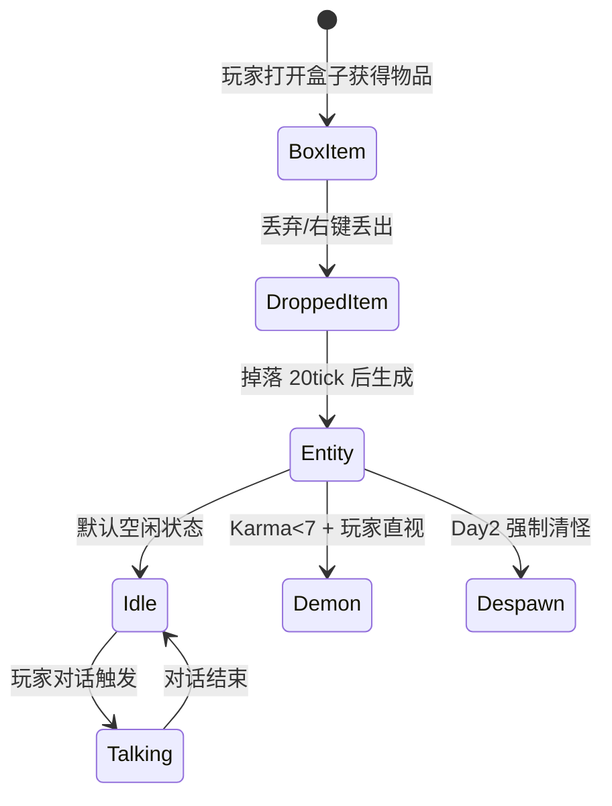

# Verity 实体

VerityEntity 是模组的核心球形生物，继承 `PathfinderMob`，具备物理滚动、弹跳变形、多纹理变体和恶魔转化能力。

## 什么是 Verity 实体？

Verity 是一个 0.5x0.5 方块的球形 AI 生物。它拥有 16 种纹理变体（happy/crazy/evil/serious 等），能通过色相旋转生成动态着色纹理。玩家可以通过文字聊天或右键与它对话，AI 根据游戏上下文回复。

**关键特征**:
- 身体是程序化渲染的球体网格（非 GeckoLib 骨骼）
- 50 帧弹跳/说话变形动画（正弦 + 三次函数）
- 16 种预定义变体 + HSB 色相动态着色
- 掉落物生成：物品掉落后 20 tick 生成实体
- 水平碰撞墙壁弹跳效果

## 代码位置

| 方面 | 位置 |
|------|------|
| 实体类 | `entity/custom/VerityEntity.java` |
| 内部 Goal | `VerityEntity.FollowPlacerGoal` |
| 渲染器 | `entity/client/SphereEntityRenderer.java` |
| 球体网格 | `entity/client/SphereMesh.java` |
| Billboard 辅助 | `entity/client/SphereRenderHelper.java` |
| 动画公式 | `entity/client/VerityAnimation.java` |
| 纹理管理 | `entity/client/VerityEntityTexture.java` |
| 物品掉落 | `item/VerityItem.java` |
| 变体定义 | `item/VerityVariants.java` |

## 结构

```java
public class VerityEntity extends PathfinderMob {
    // 状态字段
    private String variant;          // 纹理变体名 (happy/crazy/evil/...)
    private int talkingTicks;        // 剩余说话 tick 数
    private boolean isTalking;       // 是否在说话
    private int hueRotation;         // 色相旋转角度 (0-360)
    private int bounceTick;          // 弹跳动画 tick 计数
    private Vec3 lastHorizontalVelocity; // 用于碰撞弹跳

    // 核心方法
    public void tick()
    public void transformIntoDemon(Player)
    public void setVariant(String) / getVariant()
    public void startTalking(int) / stopTalking()
    public boolean isPlayerLookingAtMe(Player)
    public ResourceLocation getTextureRL()
    public void triggerBoxDrop()
}
```

## 生命周期



## 变体系统

Verity 支持 16 种纹理变体，通过 NBT tag `Variant` 存储：

| 变体 | 纹理路径 |
|------|---------|
| happy | `textures/entity/happy.png` |
| crazy | `textures/entity/crazy.png` |
| evil | `textures/entity/evil.png` |
| serious | `textures/entity/serious.png` |
| ... 等 16 种 | |

说话状态时使用 `_talking.png` 后缀纹理。所有纹理在加载后应用 HSB 色相旋转。

## 不变量

1. **纹理一致性**: `getTextureRL()` 返回的 ResourceLocation 必须与 assets 目录下实际文件对应。
2. **说话状态与动画同步**: `isTalking` 为 true 时必定伴随说话变形动画和 `_talking` 纹理。
3. **转化不可逆**: 一旦调用 `transformIntoDemon()`，VerityEntity 被移除并由 VerityDemonEntity 替代。
